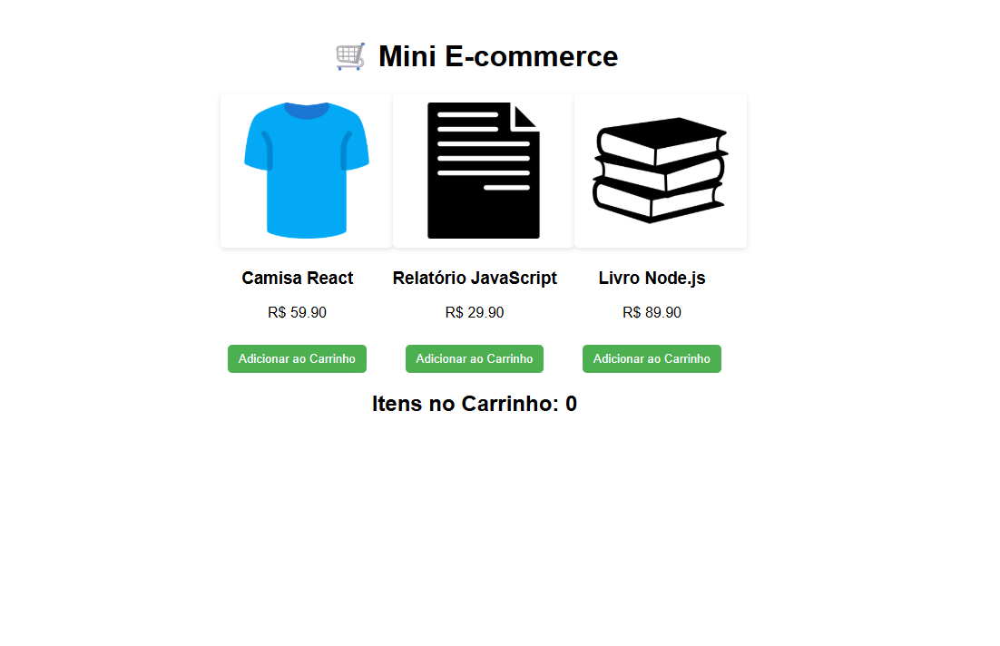

<h1 align="center">🛒 Mini E‑commerce</h1>

<p align="center">
  Projeto em <strong>React.js</strong> simulando um pequeno e‑commerce, com listagem de produtos e carrinho de compras.  
  Desenvolvido como parte do meu portfólio para demonstrar habilidades em <strong>JavaScript moderno</strong> e <strong>React</strong>.
</p>

---

## 📌 Demonstração



---

## 🚀 Funcionalidades

- 📦 Lista de produtos com nome, preço e imagem  
- 🛒 Adição de produtos ao carrinho  
- 🔄 Atualização dinâmica da quantidade de itens  
- 🎨 Imagens com fundo branco e proporção responsiva  
- ⚡ Construído em **React** com **Componentes e Hooks**

---

## 🛠️ Tecnologias Utilizadas

- React.js (Create React App)
- JavaScript (ES6+)
- CSS3
- HTML5

---

## ▶️ Como Executar Localmente

```bash
git clone https://github.com/Marcusdba/mini-ecommerce.git
cd mini-ecommerce
npm install
npm start
